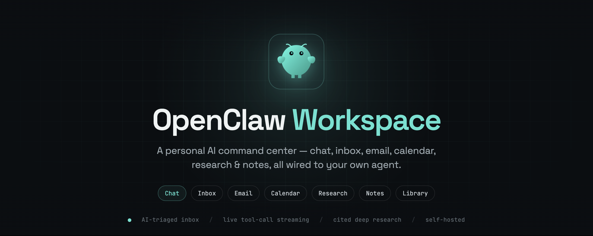
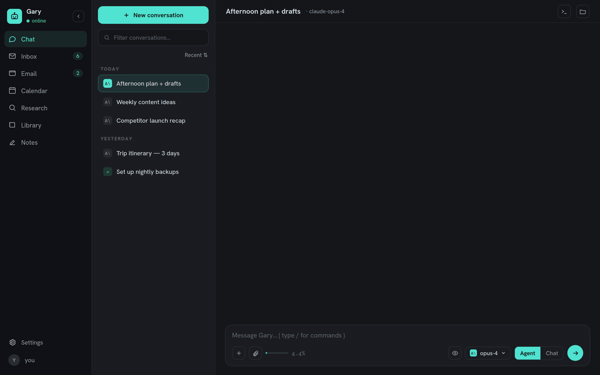
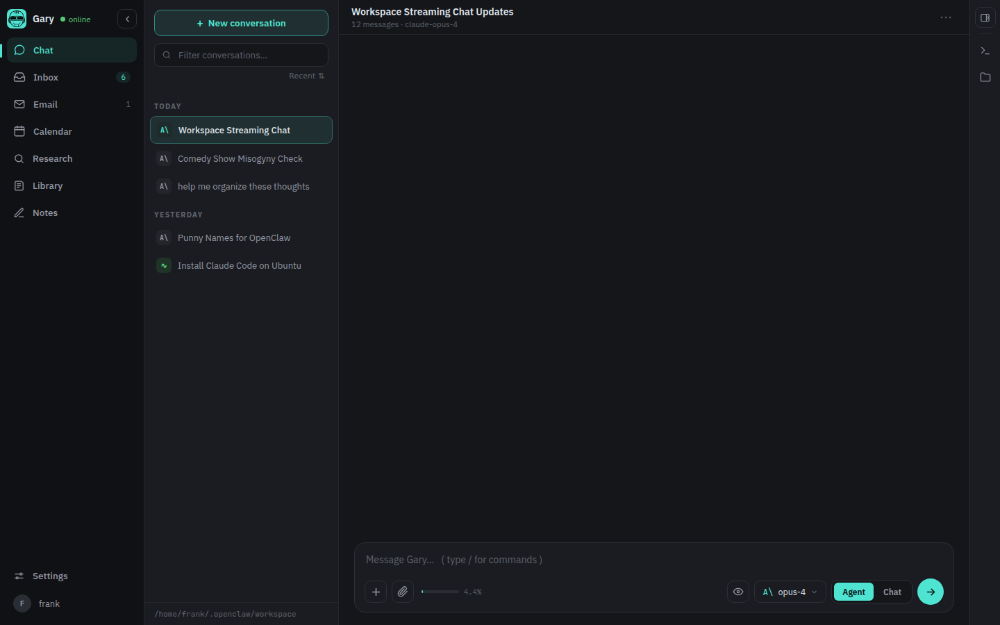
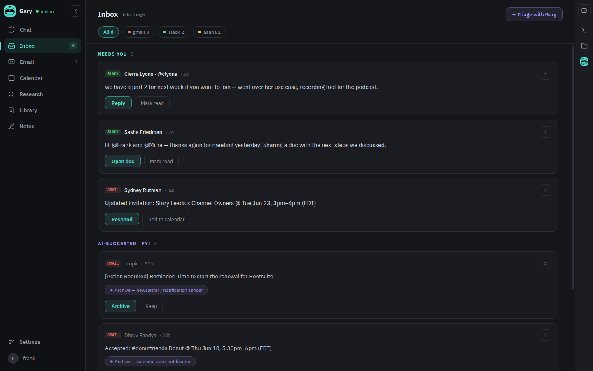
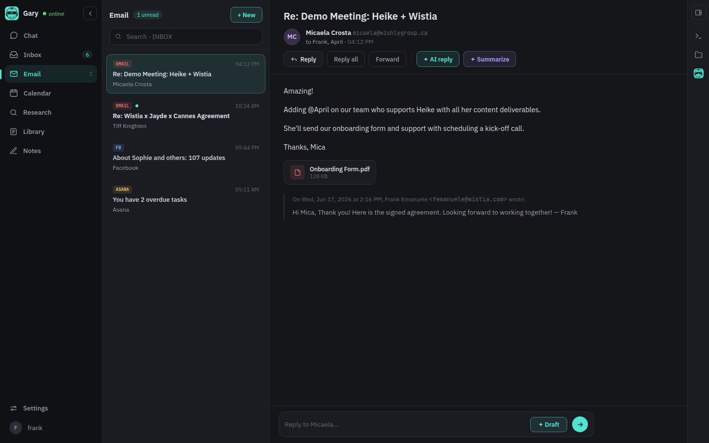
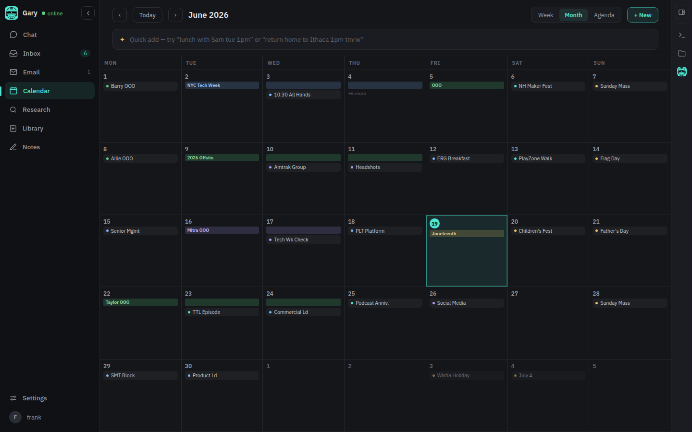
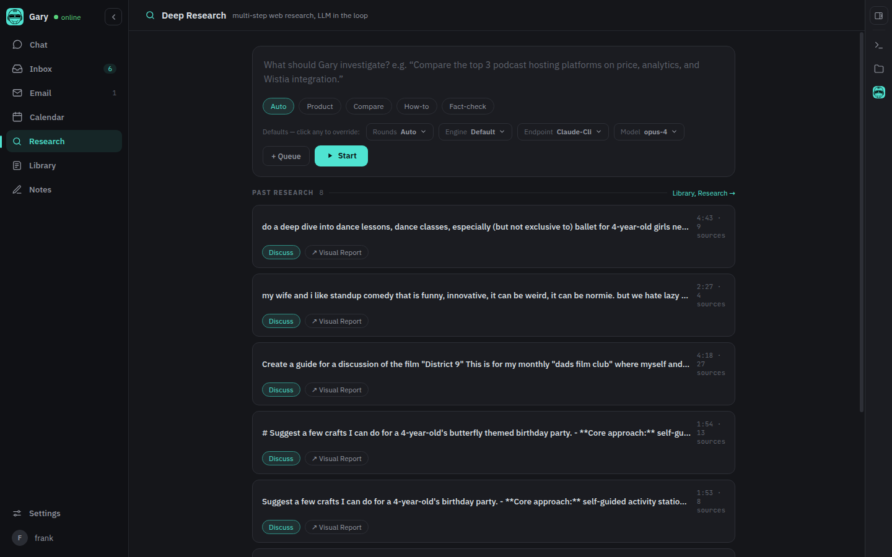
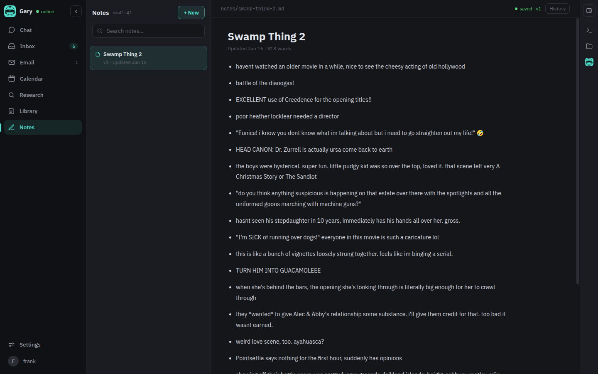

# OpenClaw Workspace

<div align="center">
  
</div>

<div align="center">

### A home for your AI assistant that actually does your busywork.

Not another chat box. It's a personal dashboard where your own AI assistant lives and works,<br>
wired into your **email**, **calendar**, **to-dos**, and **notes**, so it does the thing instead of just talking about it.

**`🧠 knows your world`&nbsp;&nbsp;·&nbsp;&nbsp;`🗂️ triages your inbox`&nbsp;&nbsp;·&nbsp;&nbsp;`✉️ drafts your replies`&nbsp;&nbsp;·&nbsp;&nbsp;`📅 runs your calendar`&nbsp;&nbsp;·&nbsp;&nbsp;`🔎 cited research`&nbsp;&nbsp;·&nbsp;&nbsp;`🔒 on your machine`**

[](https://github.com/frankramblings/openclaw-workspace/actions/workflows/ci.yml)
[](LICENSE)
[](https://python.org)
[](https://fastapi.tiangolo.com)
[](docker-compose.yml)

**[What it does](#what-it-does-for-you)&nbsp; · &nbsp;[Why it's different](#why-its-different-it-knows-you)&nbsp; · &nbsp;[The tour](#take-the-tour)&nbsp; · &nbsp;[Get started](#get-started)&nbsp; · &nbsp;[Under the hood](#under-the-hood)**

</div>

---

## What is this?

A personal command center where your own AI assistant lives. You reach it from any browser, on your phone or laptop.

Two things make it different from a regular chatbot:

- **It acts, it doesn't just answer.** It's plugged into the tools you actually use, so instead of telling you what to do, it does it: sorts the inbox, drafts the reply, adds the meeting, runs the search.
- **It knows *you*.** Because it can see your real email, calendar, tasks, and notes, everything it does is shaped by your world: your people, your projects, your voice. Not generic AI answers.

> **📦 Requires [OpenClaw](https://github.com/openclaw/openclaw) (sold separately 😉).**
> OpenClaw is the brain: it runs the AI models, memory, and tools. This project is the face, the app you actually work in, sitting on top. You point it at your OpenClaw agent, name your assistant once, and that name brands the whole app: the icon, the title bar, the chat header.

<p align="center">
  
  <br>
  <em>Ask once. It reads your calendar, searches your inbox, and drafts the reply for you.</em>
</p>

## What it does for you

Most AI apps are a lone chat window: you ask, it replies, and then *you* still have to go do the thing. This one takes the next step for you.

| | |
|---|---|
| 🗂️ **Tame the inbox** | One combined feed of Gmail, Slack, Asana, and meeting notes, sorted by *what actually needs you* vs. *just FYI*, with a suggested reply or archive on each. |
| ✉️ **Handle your mail** | A full email client where one tap drafts a reply, sends it, or summarizes a long thread. |
| 📅 **Run your calendar** | See your schedule and add events in plain English, like *"lunch with Sam Tuesday 1pm."* |
| 🔎 **Do the research** | Ask a question and get a real answer with **cited sources**, not just a guess. |
| 📝 **Keep your notes** | A shared notebook the assistant can read *and* write, so what you jot and what it finds live in one place. |
| 🔒 **Stay private** | Runs on your own computer, talks only to your own assistant. Nothing lives on someone else's server. |

## Why it's different: it knows you

A generic chatbot can't do this. Because it's wired into your real email, calendar, tasks, and notes, it builds a picture of your world: your people, your projects, your deadlines, how you write. **Every source you connect makes it sharper**, and it all stays on your machine.

That context shows up in everything it does:

- **Drafts sound like you.** It's read your past replies, so it matches your voice instead of generic AI-speak.
- **Answers already have context.** Ask *"when am I free to meet Sam?"* and it knows who Sam is, what your calendar looks like, and the thread you're planning around.
- **Nothing falls through.** It connects dots across sources: the email that needs a calendar hold, the Slack ask that should become a task, the note that answers the question you just asked.
- **It compounds.** The more you use it, the sharper the picture gets.

> A chat box starts from zero every time. **This starts from everything it already knows about your world.**

## Take the tour

The app is organized into tabs, one for each part of your day.

<table>
<tr>
<td width="50%"></td>
<td width="50%"></td>
</tr>
<tr>
<td width="50%">💬 <strong>Chat.</strong> Streaming conversations with live tool-call cards, a model picker reading the real gateway catalog, and a <code>/commands</code> palette.</td>
<td width="50%">🗂️ <strong>Inbox.</strong> A scored triage feed across Gmail, Slack, Asana, and meeting notes, sorted by <em>needs you</em> vs. <em>FYI</em>. The agent suggests archive or reply.</td>
</tr>
<tr>
<td width="50%"></td>
<td width="50%"></td>
</tr>
<tr>
<td width="50%">✉️ <strong>Email.</strong> A full mailbox: read, search, threaded reply, send. One tap to AI-draft, AI-reply, or summarize a thread.</td>
<td width="50%">📅 <strong>Calendar.</strong> Month, week, or agenda view over Google or CalDAV. Natural-language quick-add: <em>"lunch with Sam tue 1pm."</em></td>
</tr>
<tr>
<td width="50%"></td>
<td width="50%"></td>
</tr>
<tr>
<td width="50%">🔎 <strong>Research.</strong> Multi-step web research with configurable rounds and cited inline sources <code>[n]</code>.</td>
<td width="50%">📝 <strong>Notes.</strong> A markdown vault shared with the agent. Your edits are agent-visible and vice versa, with version history and restore.</td>
</tr>
</table>

Two more round it out. 📚 **Library** is an indexed store of everything the agent has written or you've uploaded, and ⚙️ **Settings** is where you connect Ollama, Anthropic, OpenAI, DeepSeek, Groq, and toggle integrations.

> **You only see the tabs you've set up.** A fresh install with just OpenClaw shows Chat; the rest appear as you connect them.

---

## Get started

Three steps from zero to a working command center:

**1 · Connect** it to your OpenClaw agent and the accounts you use &nbsp;→&nbsp; **2 · Name** your assistant &nbsp;→&nbsp; **3 · Go**: open it in any browser and start handing off work.

```bash
# clone & enter
git clone https://github.com/frankramblings/openclaw-workspace openclaw-workspace
cd openclaw-workspace

# 1. Name your agent and bake the frontend
scripts/setup.sh                      # interactive

# 2. Install deps
python3 -m venv .venv && . .venv/bin/activate
pip install -r backend/requirements.txt

# 3. Run
uvicorn backend.app:app --port 8800   # http://127.0.0.1:8800
```

Prefer one command? `scripts/dev.sh` creates the venv, installs deps, and runs with hot-reload.

<details>
<summary>Run with Docker</summary>

```bash
cp .env.example .env           # set gateway WS + password
docker compose up --build      # http://127.0.0.1:8800
```

</details>

<details>
<summary>Run on boot (macOS)</summary>

```bash
scripts/install-launchagent.sh        # 127.0.0.1:8800, auto-restart
```

</details>

## Security

By default the port binds to `127.0.0.1`, so it's **not reachable from the LAN**. The recommended remote-access path is **Tailscale Serve** in front of `127.0.0.1:8800`.

> ⚠️ The token gate covers HTTP only. The terminal PTY WebSocket is gated by your reverse proxy. Don't expose the workspace on an untrusted network on the strength of a token alone. **The terminal is a real shell.**

## Under the hood

```
OpenClaw gateway (ws://)
        │
  bridge.py  ←─── the load-bearing piece: WS to SSE, streams tool calls live
        │
  FastAPI /api  ─── per-tab adapters (email, calendar, inbox, notes, cron…)
        │
  Vanilla JS SPA  ─── frontend-overrides/ layered onto frontend-vendor/
```

The bridge is the heart of it. It renders every tool call the moment it fires, with no polling and no page reload, while keeping you on your flat-rate OpenClaw plan instead of per-token API billing.

<details>
<summary>Configuration reference</summary>

| Variable | Default | Purpose |
|---|---|---|
| `WORKSPACE_AGENT_NAME` | from branding | Agent display name everywhere |
| `WORKSPACE_ACCENT` | `#4fe3d1` | Theme accent color |
| `WORKSPACE_SOURCE_URL` | upstream repo | Source link shown in the UI (AGPL §13). **Forks must point this at their own repo.** |
| `OPENCLAW_GATEWAY_WS` | from `openclaw.json` | Gateway WebSocket URL |
| `OPENCLAW_DEFAULT_MODEL` | `agents.list[0]` | Model for new chats |

</details>

---

[AGPL-3.0](LICENSE) © The OpenClaw Workspace authors. See [NOTICE](NOTICE).  
Built on [Odysseus](https://github.com/pewdiepie-archdaemon/odysseus) (AGPL-3.0) · talks to your [OpenClaw](https://github.com/openclaw/openclaw) agent · powered by [FastAPI](https://fastapi.tiangolo.com)
